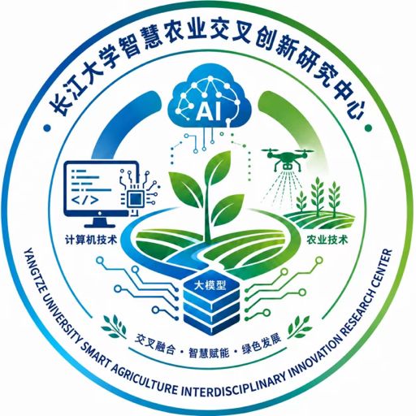

# 长大智耘 (Zhiyun)

  
  
<strong>长大智耘是长江大学智慧农业交叉创新研究中心建设的农业智能体平台，让 AI 智能体扎进真实农田。</strong>

  

    <a href="https://zhiyun.lansuan.cc">官网入口</a> ·
    <a href="https://zhiyun.lansuan.cc/about">平台介绍</a> ·
    <a href="https://zhiyun.lansuan.cc/news">研究动态</a> ·
    <a href="https://dev.zhiyun.lansuan.cc">开发者中心</a>
  

---

## 平台简介

长大智耘将农业知识、田间数据与专业工具接入大模型智能体，依托长江大学计算机科学学院与农学院交叉学科力量，把昆虫行为智能识别等研究成果转化为农田一线可用的智能助手。

平台由三端组成：

- **业务前台**（zhiyun.lansuan.cc）：农业智能对话、应用中心、插件市场、工作空间协作与定时任务
- **开发者中心**（dev.zhiyun.lansuan.cc）：技能、插件、应用与知识库四类扩展的在线开发与审核上架
- **管理后台**（admin.zhiyun.lansuan.cc）：用户、模型 Provider、审核流程与平台审计

## 核心能力

- **农业智能问答**：种植、养殖、植物保护、土壤肥料与气象节令的专业咨询
- **联网检索核实**：回答附带可核验来源链接，当前事实与历史资料严格区分
- **昆虫图像识别**：实蝇等昆虫行为智能识别研究成果的落地应用
- **知识库检索**：智能体可在平台知识库与个人知识库中查证资料后再作答
- **智能体应用**：应用中心提供沙箱化智能体应用，插件市场按需扩展对话能力
- **过程透明可验**：工具调用、思考摘要与执行事件全程流式公开呈现

  
  
平台数字人：小耘

## 研究背景

平台依托「虫姿百态」研究团队的科研成果建设：实蝇科昆虫行为智能识别方法研究获国家自然科学基金支持，相关成果发表于农林与计算机交叉领域中科院一区 Top 期刊《Computers and Electronics in Agriculture》。

## 面向人群

- **农业从业者**：种植、植保场景的专业问答与农事建议
- **科研人员**：农业 + AI 交叉研究的成果转化载体
- **开发者**：在开发者中心构建技能、插件、应用与知识库，审核上架后服务全平台

## English

**Zhiyun** is an agricultural AI agent platform built by the Smart Agriculture Cross Innovation Research Center of Yangtze University (长江大学). It connects agricultural knowledge, field data and professional tools into LLM-powered agents, turning research on insect behavior recognition into practical farming assistants. Visit <https://zhiyun.lansuan.cc> to learn more.

---

© 长江大学智慧农业交叉创新研究中心 · 平台官网：https://zhiyun.lansuan.cc
